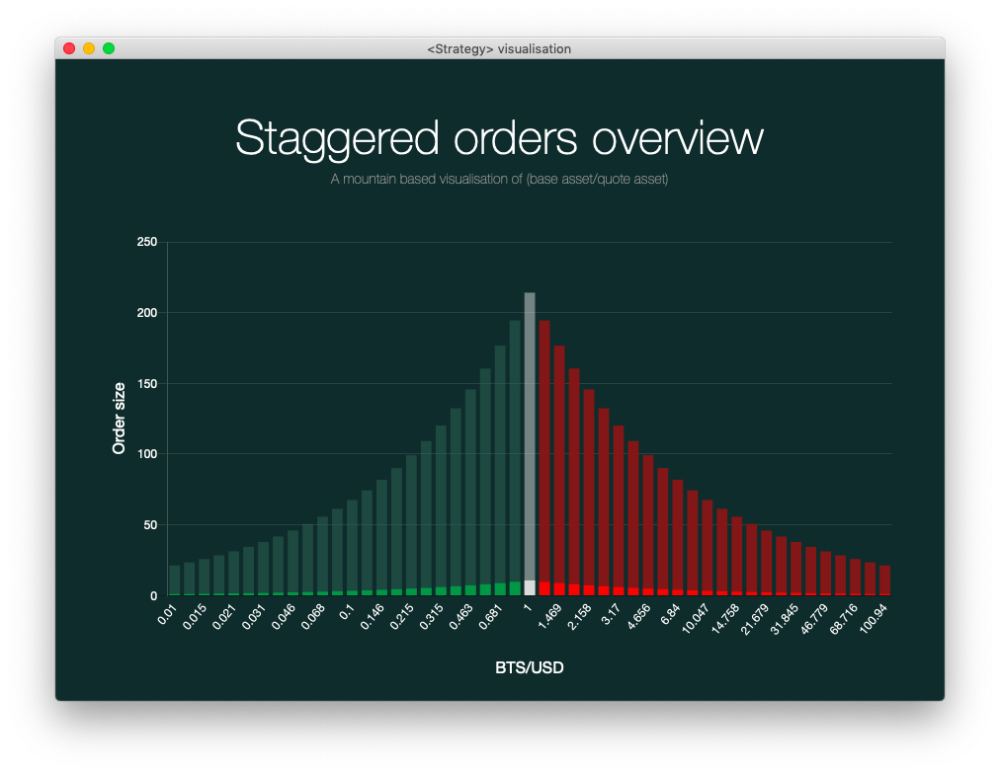
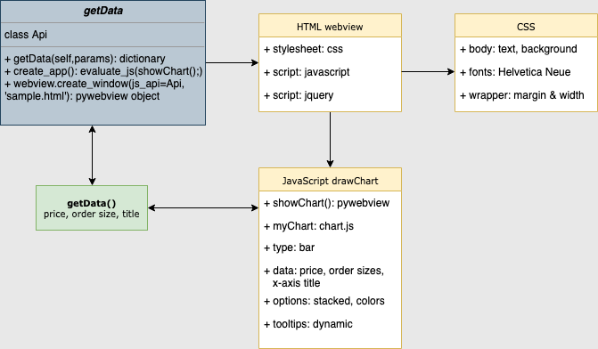

# DEXBot visualisation (test phase)

[DEXBot](https://github.com/Codaone/DEXBot)

This visualisation represents a worker's initial order size and current order size. One glance at the chart tells the user how his worker is doing in terms of profits being redistributed to orders or initial orders being decreased due to losses.

This visualisation uses [Dash/plotly](https://dash.plot.ly) which is a Python framework for building web applications. It allows you to build applications with a webview interface in either Python, JavaScript, HTML, and CSS in Python's own native GUI window.
Thus, this wrapper allows data to be parsed from DEXBot (Python) to this visualisation app (primarily HTML and CSS) on a localhost. Whereas the previous framework used [chart.js](https://github.com/chartjs) for the charting part, this application simply uses plotly.

The application is currently in its testing phase and will be implemented in DEXBot in the near future.

This picture represents how the visualisation should be.

